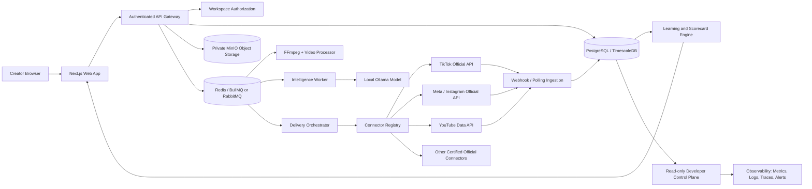

# ViralBoost: High-Value Product Launch Roadmap and Technical Architecture

**Document owner:** Manus AI  
**Product:** ViralBoost  
**Audience:** Founder, engineering, product, security, creator-operations, and future investor stakeholders  
**Status:** Launch architecture and roadmap  
**Last updated:** August 25, 2026

## 1. Executive thesis

ViralBoost should not be positioned as another social scheduler or as a machine that guarantees virality. Its category-leading opportunity is to become the **creator growth operating system** that connects one original source asset to platform-native variants, creator-approved distribution, measurable outcomes, and evidence-based next experiments.

The product’s defensible asset is the private **content-outcome graph**: source video → creative fingerprint → variants → approval → delivery attempt → platform observation → creator baseline → next hypothesis. Every workflow should make that graph more complete, more trustworthy, and more useful to the creator.

The launch objective is therefore:

> **Maximize compliant, creator-authorized, measurable organic reach and learning velocity, without fake engagement, unauthorized access, paid amplification, or claims of feed control.**

A high valuation is not a software feature and cannot be guaranteed. The product earns high-value potential by proving customer demand, retention, measurable creator improvement, low delivery failure, proprietary outcome data, and a scalable operating model.

## 2. Current baseline

The repository already contains important foundations: invite-only workspace access, creator dashboard and Growth Studio, read-only developer oversight, private MinIO source storage, queued video processing, local Ollama-compatible intelligence, platform capability metadata, encrypted social tokens, creator approval and publish-intent state, deterministic retries, reach planning, baseline-aware learning signals, and experiment scorecards.

The latest validated repository milestone is `abaa5f1`, which expands the one-source Studio flow across TikTok, Instagram Reels, YouTube Shorts, Facebook Reels, X, and LinkedIn. The application and API contracts build successfully, but the following are still release gates: production OAuth, official platform delivery connectors, token refresh, metric ingestion, persistent-host deployment, real database migration testing, operational recovery testing, and cohort evidence.

| Capability | Current state | Launch requirement |
|---|---|---|
| Invite-only creator access | Implemented and contract-tested | Keep closed during alpha and private beta. |
| Source upload and private storage | Implemented against self-hosted MinIO | Run with real MinIO, object lifecycle policies, malware/content validation, and backup/restore tests. |
| Video processing | Queue dispatch and polling implemented | Add durable progress events, worker metrics, retry recovery, and real FFmpeg validation. |
| Creative fingerprint and experiment planning | Implemented deterministically | Add richer production analysis and human-reviewed quality evaluation. |
| Creator approval lifecycle | Implemented with audit and idempotency safeguards | Connect to official delivery workers without conflating approval, scheduling, or publishing. |
| Platform capability registry | Implemented | Add real OAuth handoffs and connector certification one platform at a time. |
| Platform publishing | Explicitly gated; no production connector yet | Implement, audit, and runtime-test official APIs. |
| Performance scorecard | Implemented with baseline and sample thresholds | Add platform-specific ingestion, attribution, cohort views, and retention analysis. |
| Developer oversight | Implemented as governed read-only control plane | Add operational alerts and privacy-safe aggregate reporting. |
| Self-owned intelligence | Local Ollama adapter implemented | Pin models, evaluate quality, monitor drift, and document fallback behavior. |
| Production operations | Compose architecture documented; runtime deferred | Deploy on a persistent Docker-capable host and test failure recovery. |

## 3. Target architecture



### 3.1 Web application

The Next.js application should have four distinct experiences. **Growth Studio** is the primary creator workflow: upload, select, analyze, plan, review, approve, monitor, and learn. **Creator Operations** manages authorized platform connections, delivery history, failed jobs, token health, and audit history. **Creator Analytics** presents baseline-relative outcomes, cohort views, and next-experiment recommendations. **Developer Oversight** shows access governance, system health, aggregate portfolio status, and read-only content ledgers; it must not contain creator edit, approval, pause, schedule, or publish controls.

The browser must never hold privileged platform secrets. It should call same-origin authenticated routes or a short-lived session bridge. Mutations require CSRF protection, workspace authorization, idempotency keys, and audit events.

### 3.2 API gateway

The Hono API gateway remains the policy enforcement point. Each route should perform authentication, workspace authorization, role authorization, input validation, object ownership validation, rate limiting, idempotency handling, and audit logging before business logic.

Recommended bounded API groups are:

| Group | Responsibilities |
|---|---|
| `/auth` | Invite-gated registration, session issuance, revocation, and account recovery. |
| `/workspaces` | Creator workspace profile, membership, audit visibility, and settings. |
| `/videos` | Multipart upload, source status, processing progress, source metadata, and archive. |
| `/growth` | Fingerprinting, experiment plans, reach plans, readiness, learning signals, and scorecards. |
| `/accounts` | Capability registry, connection readiness, OAuth start/callback, token health, account analytics, and disconnect. |
| `/publishing` | Draft intents, approval, scheduling, delivery status, retries, dead-letter recovery, and audit history. |
| `/webhooks` | Signature verification, replay protection, deduplication, raw-event retention policy, and normalized observations. |
| `/owner` | Invite management and read-only developer oversight only. |
| `/health` and `/ready` | Liveness, dependency readiness, queue health, model availability, storage checks, and migration state. |

### 3.3 Data and content model

PostgreSQL is the system of record. TimescaleDB-style time-series access is appropriate for high-volume observations, but the launch design should preserve clear relational ownership and avoid premature denormalization.

Core entities are `User`, `Workspace`, `WorkspaceMember`, `Invitation`, `Video`, `VideoVariant`, `SocialAccount`, `ScheduledPost`, `PublishingAttempt`, `Metric`, `WebhookDelivery`, `AuditLog`, `Campaign`, and `IntelligenceArtifact`.

Every creator-owned entity must carry a workspace boundary or be reachable only through a workspace-owned parent. Store source bytes and derived media in MinIO with generated, non-guessable object keys such as `workspaces/{workspaceId}/sources/{videoId}/original`. Do not place access tokens, raw webhook payloads, or private source URLs in browser-visible responses.

Metric ingestion must preserve provenance: platform, account ID, remote post ID, metric name, value, observation time, ingestion time, API version, and source event ID. A unique constraint on `(platform, remotePostId, metricName, observedAt)` or an equivalent event identity prevents duplicate observations.

### 3.4 Queue and worker architecture

Use separate queues for `video-processing`, `intelligence`, `delivery`, `metric-ingestion`, and `webhook-reconciliation`. Each job must include workspace ID, entity ID, deterministic job identity, schema version, correlation ID, attempt count, and created timestamp.

Every worker must be idempotent. Processing should reuse an active job, delivery should reuse a publish-intent idempotency key, and metric ingestion should deduplicate by remote event identity. Retries should be bounded with exponential backoff and jitter. Terminal failures move to a dead-letter state with a human-readable reason, retryability classification, and a creator-visible recovery action.

## 4. Official platform connector strategy

Build connectors as isolated adapters behind a common interface:

```text
authorize() -> OAuth handoff
callback() -> validated account + encrypted token set
refresh() -> rotated token set or explicit reauthorization state
validate() -> capability and account readiness
prepare() -> platform-specific payload and media requirements
publish() -> remote post ID or typed failure
status() -> remote processing/delivery state
fetchMetrics() -> normalized observations
revoke() -> local credential removal and provider revocation where supported
```

Do not implement all platforms simultaneously. Use a certification sequence:

| Order | Connector | Initial scope | Exit evidence |
|---:|---|---|---|
| 1 | YouTube | OAuth, upload, privacy/schedule metadata, status, basic statistics | Test channel upload, retry, quota handling, audit, and private-by-default behavior. |
| 2 | Instagram | Professional-account authorization, media container, resumable video path, publish, status, insights | Test public-host media requirement, permission errors, rate limits, webhooks, and revocation. |
| 3 | TikTok | Creator authorization, Direct Post and/or draft-upload path, status, supported metrics | Test creator settings, draft/direct distinction, review requirements, rate limits, and failure recovery. |
| 4 | Additional platforms | Add only after provider terms, capability, quota, and analytics contracts are documented | Each connector receives a separate certification report. |

TikTok documents both direct posting and draft-upload flows, with creator-facing settings and creation-flow behavior.[1] Instagram’s current documentation requires professional accounts, appropriate Meta login and permissions, server-reachable media, media containers, publish calls, status checks, and rate-limit management.[2] YouTube’s `videos.insert` requires OAuth upload permissions and notes that unverified API projects can be restricted to private viewing until audit.[3]

The architecture must treat provider terms, app review, quota, rate limits, content policies, and ranking systems as external constraints. No connector may claim guaranteed reach, timeline placement, or recommendation treatment.

### Connector implementation options

| Option | Advantages | Disadvantages | Recommendation |
|---|---|---|---|
| Build direct official connectors in-house | Best control, self-owned data, no intermediary dependency, strongest product moat | Slower initial delivery, provider reviews and maintenance are substantial | **Use this as the primary strategy**, beginning with one platform. |
| Use a third-party publishing hub | Faster breadth and potentially easier provider maintenance | Conflicts with self-owned requirement, creates dependency and data/control leakage, weaker differentiation | Use only as a temporary research or fallback option, never as the core architecture. |
| Start with one deep connector, then expand | Highest quality, clearer cohort evidence, simpler support and debugging | Slower “any platform” coverage | **Recommended launch path:** certify one platform deeply, then add the next based on creator demand. |
| Build all advertised platforms before beta | Broad marketing story | High integration risk, poor reliability, diluted learning, and unsupported claims | Do not use. |

OAuth must follow current best practices: authorization code flows, PKCE where applicable, exact redirect URI validation, state/nonce and issuer validation, short-lived access tokens, refresh-token rotation where available, least-privilege scopes, encrypted storage, revocation, and no implicit or password grants.[6]

## 5. Intelligence and learning system

The intelligence layer should use local models for content understanding and suggestion generation, but all recommendations must be traceable to source evidence and separated from observed facts. Store the model name, version, prompt/template version, input artifact IDs, output artifact ID, timestamp, and evaluation status for every generated artifact.

The learning engine should include five levels:

| Level | Function |
|---|---|
| **Observation** | Normalize platform events and snapshots without interpretation. |
| **Attribution** | Connect a remote post and metric observation to a workspace-owned variant and source. |
| **Comparison** | Compare the variant with a creator-specific baseline using a declared objective. |
| **Decisioning** | Return `continue_collecting`, `retain_and_retest`, `revise_hypothesis`, or `inconclusive` with evidence quality and safeguards. |
| **Planning** | Generate the next controlled experiment while preserving the creator’s voice and changing a limited number of variables. |

Do not use raw views as the only north-star metric. The initial scorecard should include qualified watch-through, completion, shares, saves, meaningful comments, profile actions, follower conversion, repeat viewers, and time-to-signal. Track both absolute values and baseline-relative movement. Establish minimum sample requirements, confidence labeling, missing-data states, and explicit “not enough evidence” outcomes.

## 6. Security, privacy, and trust

Use OWASP ASVS 5.0 as the application verification baseline; OWASP describes ASVS as a basis for testing web application security controls and secure-development requirements.[4] Use NIST SSDF 1.1 to structure secure development, release provenance, vulnerability response, and protected build environments.[5]

Required controls include:

| Control area | Launch requirement |
|---|---|
| Identity | Invite-only registration, MFA for developer identity, session rotation, revocation, secure recovery, and device/session visibility. |
| Authorization | Deny-by-default workspace checks on every object access; separate platform-owner oversight from creator workflow control. |
| Credentials | AES-256-GCM or a managed secret vault, key rotation, envelope-key strategy, redacted logs, no token exposure in API responses, and revocation workflows. |
| Upload security | MIME and extension validation, size limits, safe filename handling, malware scanning where available, isolated processing, resource limits, and no shell interpolation. |
| Web security | CSRF protection, CSP, secure cookies, TLS, strict redirect allowlists, output encoding, rate limits, and abuse monitoring. |
| Data governance | Data inventory, retention periods, deletion/export workflow, source provenance, webhook minimization, privacy notice, and creator-controlled disconnect/delete. |
| Supply chain | Lockfiles, dependency scanning, SBOM, signed releases, image scanning, pinned base images, secret scanning, and provenance records. |
| Audit | Immutable append-only creator and operator events with actor, workspace, resource, before/after state, timestamp, request ID, and reason. |

A security release cannot pass while secrets are hard-coded, account tokens are plaintext, workspace isolation is untested, or publishing can occur without an approved creator intent.

## 7. Reliability and operations

Production deployment should use a persistent Docker-capable host or managed equivalent with encrypted disks, private network segmentation, automated backups, off-site backup copies, restore drills, and documented recovery objectives. The current Compose topology is a good self-hosted baseline, but it must be run and verified on a real target.

Define service-level objectives before public availability. Suggested initial targets are 99.5% monthly API availability, 99% successful processing completion for valid inputs, 99% idempotent queue behavior, less than 1% unclassified delivery failures, and recovery from a worker crash without duplicate publishing. These are engineering targets, not guarantees to creators.

Health checks must distinguish liveness from readiness. Readiness should verify database connectivity and migration state, Redis/RabbitMQ reachability, MinIO bucket access, queue consumer health, local-model availability, encryption-key presence, and connector configuration. Observability must include structured logs, traces by correlation ID, queue depth, job age, retry counts, dead-letter counts, token failures, webhook lag, metric freshness, and creator-visible incident states.

## 8. Phased launch roadmap

### Gate 0: Foundation hardening

Freeze the domain model, migration order, API contracts, and threat model. Apply migrations to a disposable PostgreSQL instance. Add contract tests for tenant isolation, token redaction, idempotency, audit atomicity, upload validation, and role boundaries. Create a reproducible local stack with secret templates and no real credentials.

**Exit gate:** clean builds, migrations apply and roll back on a disposable database, critical security tests pass, and backup/restore procedure is documented.

### Gate 1: Private creator alpha

Use five to ten selected creators. Enable source upload, processing, fingerprinting, experiment planning, scorecards, and manual creator approval. Keep official publishing disabled or limited to one certified connector. Collect qualitative usability evidence and all workflow failures.

**Exit gate:** creators can complete source-to-learning workflows without developer hands-on content operations; no cross-workspace data leakage; processing and retry states are understandable.

### Gate 2: First certified connector

Implement one official connector deeply, including OAuth, secure token lifecycle, media requirements, provider status, delivery retries, rate limits, webhook or polling reconciliation, metrics ingestion, revoke, and audit. Start with private/unlisted delivery settings where provider rules require it.

**Exit gate:** repeated test runs prove no duplicate posts, no secret exposure, correct approval gates, correct remote-state reconciliation, and clear failures.

### Gate 3: Evidence beta

Expand to twenty to fifty invited creators only after the first connector is stable. Add platform-specific scorecards, baseline cohorts, controlled experiment review, source provenance, and creator-visible recommendations. Compare creator retention, workflow completion, and outcome changes with a predeclared evaluation plan.

**Exit gate:** measurable improvement in qualified outcomes for a meaningful share of active creators, not merely inflated impressions; strong weekly retention; low support burden; and no material trust incidents.

### Gate 4: Multi-platform expansion

Add Instagram and TikTok, then further platforms based on creator demand and connector economics. Each connector must pass a separate certification checklist and be clearly labeled by capability. Do not market a platform as supported until its official connection, delivery, metrics, and failure recovery are tested.

**Exit gate:** stable multi-platform delivery, fresh metrics, quota visibility, provider-compliant app-review status, and support playbooks.

### Gate 5: Premium launch

Launch as a selective, premium product rather than a mass-market tool. Offer invitation-based creator pilots, concierge-grade onboarding without taking content control, advanced scorecards, team or manager read-only views where creators explicitly consent, and paid tiers only after clear value is demonstrated.

**Exit gate:** repeatable acquisition channel, strong creator retention, paid conversion, gross-margin model, documented security posture, incident response, and a credible data moat.

## 9. Metrics that create company value

| Metric group | Metrics |
|---|---|
| Creator activation | Time from invitation to first processed source, first approved experiment, first successful delivery, and first learning signal. |
| Product engagement | Weekly active creators, experiments per active creator, approval rate, scorecard review rate, and learning-loop completion. |
| Creator outcomes | Baseline-relative qualified retention, completion, shares, saves, profile actions, follower conversion, and repeat audience behavior. |
| Reliability | Processing success, delivery success, duplicate-prevention rate, metric freshness, webhook lag, retry rate, dead-letter rate, and recovery time. |
| Business | Paid conversion, expansion, gross margin, support hours per creator, net revenue retention, and creator referral rate. |
| Trust | Token incidents, workspace-isolation incidents, deletion requests completed on time, audit completeness, and creator-reported confidence. |

The evaluation design should predeclare primary outcomes, observation windows, minimum samples, missing-data handling, and what constitutes a successful experiment. Avoid cherry-picking a single viral post. A strong investor-grade claim is: “Among a defined cohort, creators using the measured experiment loop improved a predeclared qualified outcome relative to their own baseline,” supported by reproducible data.

## 10. Valuation-relevant moat

The high-value thesis rests on five compounding assets. First is proprietary, permissioned creator outcome data that improves recommendations. Second is workflow trust: creators retain ownership and can understand every recommendation and action. Third is connector and orchestration reliability that turns experimentation into repeatable operations. Fourth is self-owned infrastructure and local intelligence that reduce dependency and improve privacy. Fifth is a high-quality cohort and evaluation dataset that competitors cannot easily reproduce.

These assets only compound if ViralBoost follows strict consent, privacy, deletion, and provider-compliance rules. A shortcut involving fake engagement, unauthorized automation, feed manipulation, or misleading claims would damage the product’s legal, platform, and valuation profile.

## 11. Launch checklist

| Area | Must be true before launch |
|---|---|
| Product | Creator can upload, process, analyze, choose platforms, approve, monitor, and learn without developer intervention. |
| Integrations | Every advertised platform has a certified official connector or is clearly marked unavailable. |
| Security | ASVS-based verification, secret scanning, token encryption, workspace isolation tests, secure OAuth, and incident response are complete. |
| Data | Metrics have provenance, deduplication, retention rules, deletion pathways, and baseline evaluation methodology. |
| Reliability | Persistent deployment, migrations, backups, restores, health checks, queues, retries, dead letters, and alerts are runtime-tested. |
| Trust | No guarantee of virality, fame, impressions, or feed placement; clear creator approval and platform-authority language exists throughout. |
| Business | Cohort evidence, willingness-to-pay, retention, support economics, and a repeatable acquisition strategy are documented. |

## 12. Recommended immediate build order

The next implementation sequence should be: **(1)** disposable PostgreSQL migration and restore validation; **(2)** connector capability and OAuth state machine; **(3)** one certified official connector with delivery and metric ingestion; **(4)** creator delivery history and recovery UI; **(5)** platform-specific scorecards and cohort evaluation; **(6)** persistent deployment with observability and incident drills; and **(7)** private alpha with a measured evaluation protocol.

Do not spend the next cycle on more superficial dashboards or additional unsupported platform labels. The highest-value work is proving that one creator can move from private source to approved official delivery to trustworthy outcome learning with minimal intervention and no duplicate, unauthorized, or misleading behavior.

## References

[1]: https://developers.tiktok.com/products/content-posting-api/ "TikTok for Developers: Content Posting API"
[2]: https://developers.facebook.com/documentation/instagram-platform/content-publishing "Meta for Developers: Instagram Content Publishing"
[3]: https://developers.google.com/youtube/v3/docs/videos/insert "Google Developers: YouTube Data API videos.insert"
[4]: https://owasp.org/www-project-application-security-verification-standard/ "OWASP Application Security Verification Standard"
[5]: https://csrc.nist.gov/projects/ssdf "NIST Secure Software Development Framework"
[6]: https://datatracker.ietf.org/doc/rfc9700/ "IETF RFC 9700: Best Current Practice for OAuth 2.0 Security"
